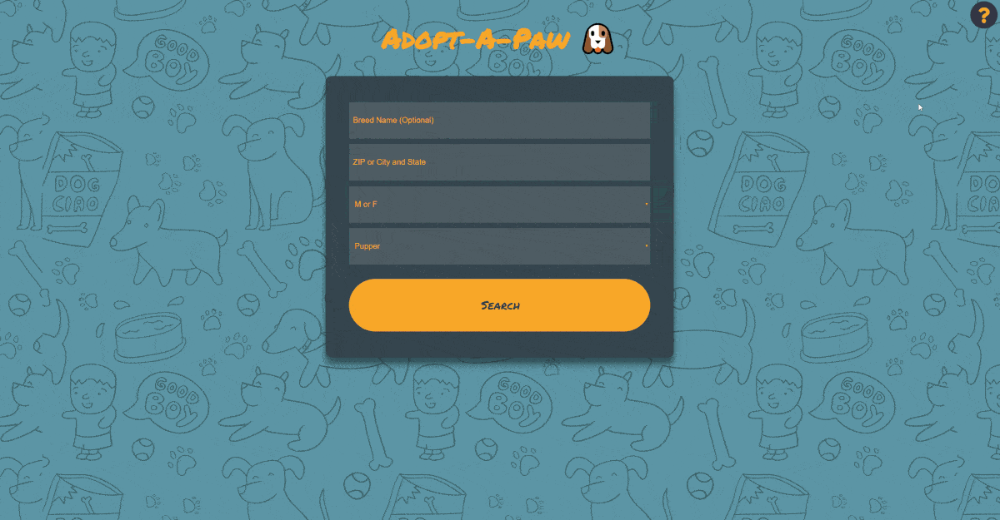

# Adopt-A-Paw 🐶

Simple application that helps users to find dogs that can be adopted at their location. This app returns results from all over the country and even from abroad since dog-shelters often will fly adopted dogs to their forever home.

[**Live-Demo**](<http://ievgenk.github.io/adopt-a-paw>)

## Animated Showcase

##  Technologies Used

- HTML
- CSS
- JavaScript
- jQuery
